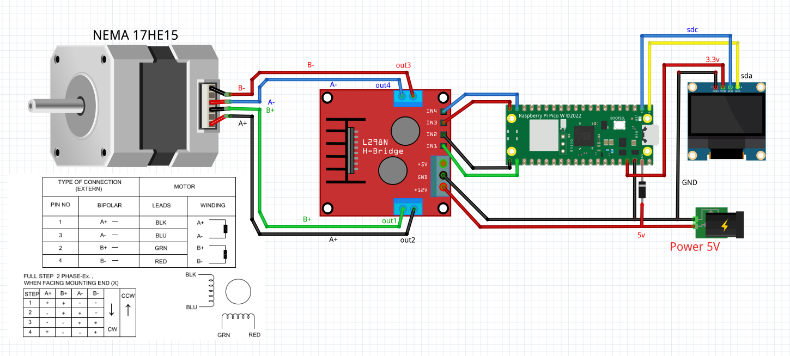
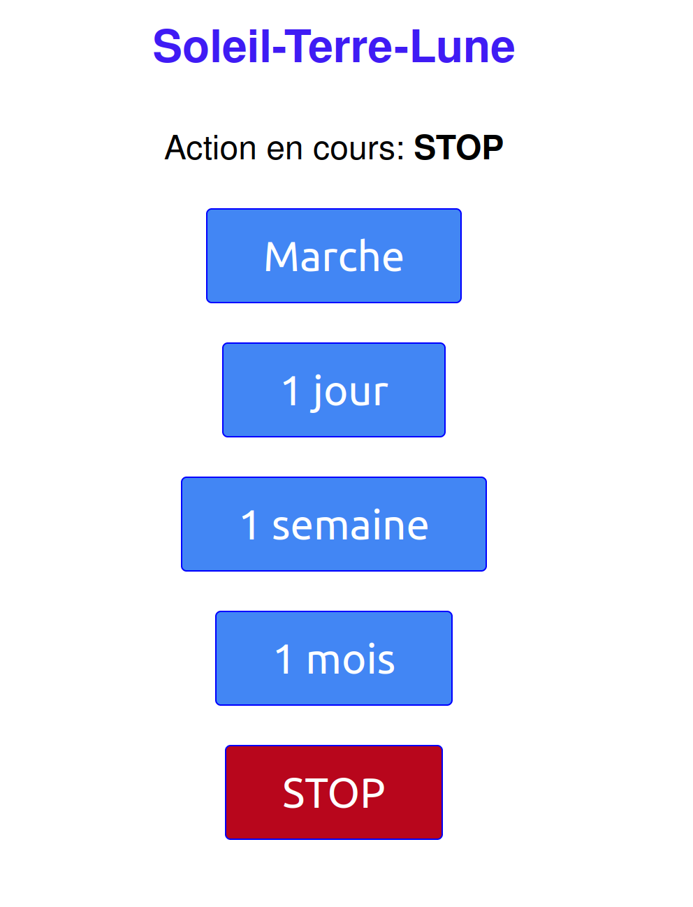

# Micro WebServer pilotage StepperMotor

Ce projet concerne la motorisation du [planétaire mécanique](https://papsdroidfr.github.io/tutoriels/soleil-terre-lune/)

## Hardware

### schéma

Attention à bien respecter le câblage, sinon le moteur ne va pas fonctionner correctement.

### matériel nécessaire
- Un Raspberry PICO W
- Un moteur NEMA 17HE15
- Un driver L298N
- Un écran OLED I2C SSD1306
- une alimentation DC 5V 2A pour alimenter le moteur

## Software 

- Installez la dernière version de micropython sur le [raspberry pico](https://papsdroidfr.github.io/configuration/pico/)
- Uploader à la racine du Raspberry PICO tous les dossiers et fichiers à récupérer depuis **/micropythonPICO**
- Dans le fichier **web/config.py**, mettez à jour votre SSID et Password wifi auquel vous voulez vous connectez

## Usage

- Lors du démarrage du raspberry pico, l'écran OLED affiche un logo du WIFI qui clignote le temps que la connexion WIFI se fasse.
- Lorsque la connection wifi est établie, le serveur WEB démarre: l'écran OLED affiche l'adresse locale du serveur http://xxxx.xx.xx.xx
- Connectez-vous à cette adresse depuis votre smartphone en utilisant le même réseau wifi.

