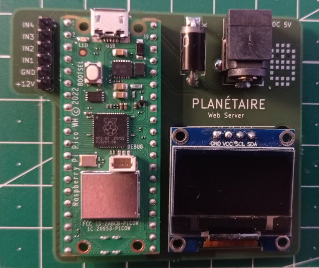

# Micro WebServer pilotage StepperMotor

Ce projet concerne la motorisation du [planétaire mécanique](https://papsdroidfr.github.io/tutoriels/soleil-terre-lune/)

## Hardware

### Schéma

Attention à bien respecter le câblage, sinon le moteur ne va pas fonctionner correctement.

### Matériel nécessaire
- Un Raspberry PICO WH
- Un moteur NEMA 17HE15
- Un driver L298N
- Un écran OLED I2C SSD1306 128x64 taille 0.96'
- une diode Shottkey
- Un connecteur DC 5v 3 pattes
- Une rangée de 6xpin header mâles, pas 2.54mm
- 4 câbles dupont femelle-femelle (10cm) pour relier la carte aux entrées IN du driver L298N
- 2 câbles dupont mâle-femelle (10cm) rouge et noir pour alimenter le driver L298N
- 4 câbles dupont mâle-mâle (20cm) pour relier les sorties du driver L298N au moteur
- une alimentation DC 5V - 2A
- _Optionnel_: Un PCB à faire imprimer, vous retrouverez les fichiers GERBER zipé dans le dossier **/PCB**
- _Optionnel_: Un boitier imprimé 3D, le STL est dans le dosseir **/STL**

## Software 

- Installez la dernière version de micropython sur le [raspberry pico](https://papsdroidfr.github.io/configuration/pico/)
- Uploader à la racine du Raspberry PICO tous les dossiers et fichiers à récupérer depuis **/micropythonPICO**
- Dans le fichier **web/config.py**, mettez à jour votre SSID et Password wifi auquel vous voulez vous connectez

## Usage

- Lors du démarrage du raspberry pico, l'écran OLED affiche un logo du WIFI qui clignote le temps que la connexion WIFI se fasse.
- Lorsque la connection wifi est établie, le serveur WEB démarre: l'écran OLED affiche l'adresse locale du serveur http://xxxx.xx.xx.xx
- Connectez-vous à cette adresse depuis votre smartphone en utilisant le même réseau wifi.

